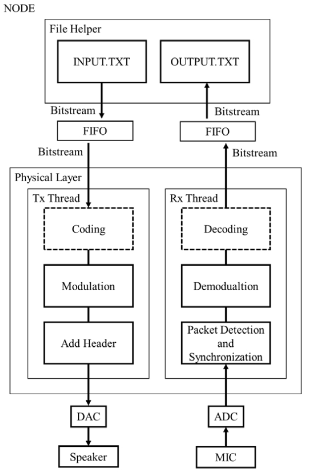
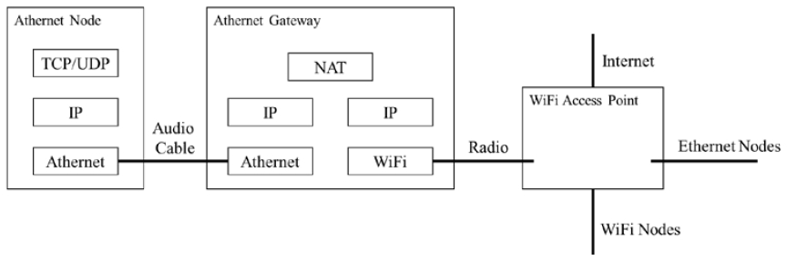

# Athernet

Athernet is a toy network that transmits data through audio connections. We implemented most of the functionalities in the order of project 1, project 2, project 3, and project 4 (each project is based on the previous project). The detailed requirements for each project can be found in the corresponding folder.

# Acknowledgement

This project was completed with https://github.com/Silverhza.


## Prerequisites

We strongly recommend that you run the code in a conda environment with `Python 3.7.9`. The code has been tested on a Windows 10 machine.

```bash
bitarray 1.6.0
bitstring 3.1.7
crcmod 1.7
matplotlib 3.3.1
numpy 1.19.1
python-sounddevice 0.4.0
scipy 1.5.2
tqdm 4.55.1
```


## Project 1

### Overview

In this project, we built the physical layer. We first tried to record and play designated signals separately, then we tried to play and record simultaneously and finally we tried to transmit data through acoustic connections.

<div align=center></div>


### Technical Details

We used the `sounddevice` packet to achieve basic audio functionality like recording and playing, then we took advantage of these two functionalities to transmit data through audio devices.

We first pack data into small frames according to the length of a frame, which is a fixed parameter. We also add a header (includes the ID of a frame) and a crc check field (calculated from the payload) to each frame, so that the integrity of the data can be verified.

To increase the efficiency and robustness of transmission, the frames should be modulated before sending into the audio device. We use PSK with a carrier wave to modulate the frame into a wave, where the carrier wave is a predefined wave used by both transmitter and receiver. Also, to help the receiver recognize a valid frame, we add a predefined preamble wave before the actual frame. Now, we can send the whole wave into the speaker.

The receiver receives audio input and tries to locate a frame sent by transmitter. Once a preamble wave is recognized by the receiver, the receiver finds the location that the correlation of predefined preamble wave with received preamble reaches a peak, then set it as the start of the frame. The receiver then tries to decode the frame by first smoothing the signal with a low-pass filter and then transform float values into binary values. Crc check is necessary since it is unknown if the frame is damaged, the receiver reports the status of each decoded frame.

Finally, we write the received data into a file and check the overall accuracy.


### Challenges

In actual tests, we found that the last packet is easily lost, so we add some random wave at the end of the transmission. However, the most tricky part is finding the best parameters (and there are a lot of them), it cost us a lot to adjust the parameters. Moreover, the statuses of the speaker and the microphone are so important that even a tiny change of posture may lead to a disaster.


## Project 2

### Overview

In this project, we replaced the speaker and microphone from project 1 with audio cables, so that the Athernet can achieve higher throughput. What's more, we add ACK functionality to improve transmission quality.

<div align=center></div>


### Technical Details

We implemented a multi-threaded receiver in this project so that the decode latency is minimized. The receiver is responsible for transmitting a packet after checking the integrity of the packet, if no error is found, it sends an ACK back, indicating that the packet has been correctly received and is ready to receive the next one; if error(s) are found, it sends a NCK, requires a retransmission of the current packet.

If the transmitter successfully receives an ACK within a period of times (`timeout`), it then send the next packet; If the transmitter receives a NCK or even no packet within `timeout`, it then retransmits the current packet; If the transmitter doesn't receive any packet in a period of time (`error_time`), then it asserts for link error.

However, after days of efforts, we cannot achieve the throughput requirement specified by the project, so we only achieved the link error functionality.


### Challenges

The first challenge is multi-threading, it needs some efforts to fully understand the mechanism, especially the audio streams themselves are also multi-threaded.

The second challenge is achieving the required throughput. `Python` is a bit slow to restart audio streams so we failed this checkpoint.

The last challenge is the detection of link error, we need to choose `timeout` and `error_time` carefully, so that the messages will not be misunderstood.


## Project 3

### Overview

In this project, we built a gateway for the Athernet so that it can connect to the Internet. In order to achieve this goal, NODE2 plays a role as NAT, which translates traffic that goes though it. We simulated real network protocols such that real network functionalities can be realized with Athernet.

<div align=center></div>


### Technical Details

This project is based on project 2 and takes advantage of audio communication from it.

We first modified the frame structure so that it contains necessary information, for example, IP and port. In this procedure, we reformat the frame structure according to the real network frame structure so that it would be easier to implement NAT.

We then implemented the NAT, which will be operation on NODE2. NAT is responsible for translating Athernet traffic to the Internet and translating Internet traffic to the Athernet. Our implemented NAT works as follows:

1. For in coming Athernet traffic, the NAT extracts `<NODE1_IP, NODE1_port>` and constructs NAT table from it. Then the NAT repacks the received payload according to standard network socket with `<NODE2_IP, NODE2_port>` and send it to the destination designated by the original frame;
2. For in coming Internet traffic, the NAT repacks the received payload according to the implemented network protocol and send it to NODE1 with respect to the NAT table, through acoustic connection.

To implement ICMP echo, NODE1 can send `ICMP Echo Request` with fixed-length payload to NODE2, and NODE2 will translate it and send it to the real destination. When NODE2 receives the `ICMP Echo Reply` from the server, it repacks the received frame and send it to NODE1. Since the payload of the `ICMP Echo Request` contains the timestamp of sending time and the replied `ICMP Echo Reply` doesn't modify the payload, NODE1 can calculate the latency from the reply. Since ICMP packets have no port number, we replaced the `port` field with `ID`, which uniquely identifies the packet.


### Challenges

In fact, our biggest challenges showed up when we were reformatting the frame structure, it needs quite a lot of efforts to encode IP and port and pack them into the correct place for different protocols. It is also a bit of challenge to translate the traffic and transmit them to the real destination. Nevertheless, functionalities of this project is realized after days of hard work.


## Project 4

### Overview

This project enables the Athernet to provide FTP services. NODE1 will act as FTP client and NODE2 will act as a NAT that translates traffic between Athernet and the Internet.

<div align=center></div>


### Technical Details

At NODE1, we implemented a console for use to input FTP commands. In our implemented version, seven commands are legal: `USER, PASS, PWD, CWD, PASV, LIST, PETR`. Their functionalities are listed below:

1. `USER`: Sends the username for authentication, the default username is `Anonymous`.
2. `PASS`: Sends the password for authentication, the default password is null.
3. `PWD`: Prints the current working directory.
4. `CWD`: Changes the working directory to the designated one, must provide one parameter.
5. `PASV`: Enters the passive mode.
6. `LIST`: Returns information of a file or directory if specified, else information of the current working directory is returned..
7. `RETR`: Retrieve a copy of the file, the remote path of the file must be specified but is local path is optional.

In order to correctly send commands to the real FTP sever, NODE1 checks the commands typed into the console and asserts for wrong command, trying it's best to alleviate the Athernet's workload and provide better user experience.

Although we can reuse quite a lot of the implementation from previous projects, the `RETR` command requires much more additional efforts. In order to support transmitting files, we must add additional encoder/decoder so that the file format will be intact during transmission. Further more, we add multi-threading functionality to accelerate the encoding/decoding procedure and add a simplified version of sliding window to ensure the integrity of transmitted data. The implemented FTP client works well for small data transfer, but it needs quite a lot of time to transmit large files.


### Challenges

How to correctly transmit commands and files in Athernet is the main difficulty of this project. It took us a lot of time to figure out how to distinguish packets for commands with packets for files. Besides, the transmission latency is hard to conquer, the console may stay "not responding" for a long time.

